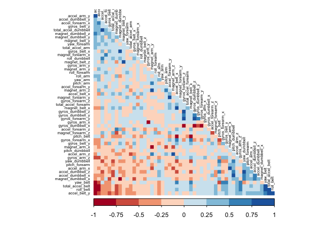
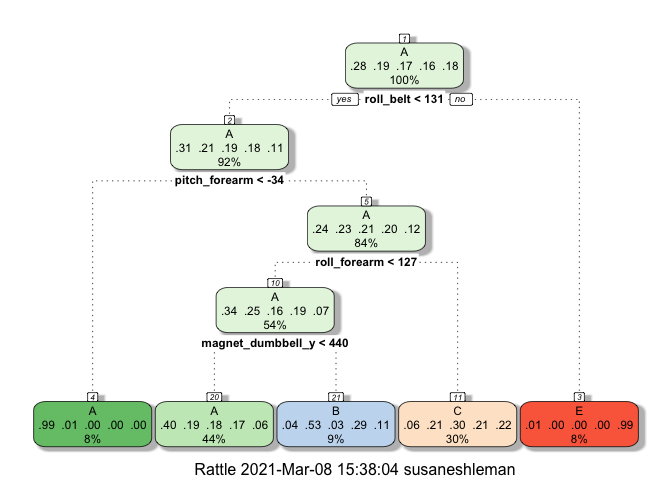

## Executive Summary

Personal fitness devices collect a large amount of data about personal activity relatively inexpensively, and this data can be used to assess many aspects of exercise and fitness, including the quality of movements. In this report, accelerometer data collected from participants who performed excercises both correctly and incorrectly was used to train multiple cross-validated machine learning algortithms to predict movement quality. The best performing model was selected based on estimated out of sample accuracy determined with a validation set, which was a subset of the training data. The best performing model, a random forests algorithm, was then used to predict movement quality in a test set of 20 cases.

## Loading and Partitioning Data 

Load required packages:

```r
library(caret)
```

```
## Loading required package: lattice
```

```
## Loading required package: ggplot2
```

```r
library(lattice)
library(ggplot2)
library(corrplot)
```

```
## corrplot 0.84 loaded
```

```r
library(RColorBrewer)
library(rattle)
```

```
## Loading required package: tibble
```

```
## Loading required package: bitops
```

```
## Rattle: A free graphical interface for data science with R.
## Version 5.4.0 Copyright (c) 2006-2020 Togaware Pty Ltd.
## Type 'rattle()' to shake, rattle, and roll your data.
```

Set seed for reproducibility purposes:

```r
set.seed(2372)
```

The training and testing data is loaded into R:

```r
train<-read.csv("https://d396qusza40orc.cloudfront.net/predmachlearn/pml-training.csv")
test<-read.csv("https://d396qusza40orc.cloudfront.net/predmachlearn/pml-testing.csv")
```

We will divide the training data into a training set and a validation set. The validation set will allow us to compare multiple cross-validated machine learning models, estimate the out of sample error for each, and select the best performing model to apply once and only once to the testing set. The data is partitioned based on the output variable (classe).


```r
inTrain<-createDataPartition(y=train$classe, p=0.7, list=FALSE)
training<-train[inTrain,]
validation<-train[-inTrain,]
```

## Tidying Data

We will be training our various machine learning models to predict the value of the "classe" variable based on the variables corresponding to the readings for one of the four sensors. Those sensor reading variable names include the substrings "_belt", "_arm", "_dumbell", and "_forearm". We will remove all columns (from all three data sets) that do not correspond to our output or input variables:


```r
inputColumns <- grep(pattern = "_belt|_arm|_dumbbell|_forearm", names(training))
training <- training[, c(inputColumns,160)]
validation <- validation[, c(inputColumns,160)]
testing <- test[, c(inputColumns,160)]
```

We should also change the "classe" variable to a factor vs character class in the training and validation data sets (classe is not included in the testing set):

```r
training$classe<-as.factor(training$classe)
validation$classe<-as.factor(validation$classe)
```

Next we should identify the variables that have near zero variability in the training set so that these columns can be removed from all three data sets:


```r
nsv<-nearZeroVar(training, saveMetrics = TRUE)
nsv
```

```
##                            freqRatio percentUnique zeroVar   nzv
## roll_belt                   1.102073    8.05124845   FALSE FALSE
## pitch_belt                  1.116279   12.32437941   FALSE FALSE
## yaw_belt                    1.049451   12.98682391   FALSE FALSE
## total_accel_belt            1.069611    0.20382907   FALSE FALSE
## kurtosis_roll_belt       2690.400000    2.04557036   FALSE  TRUE
## kurtosis_picth_belt       672.600000    1.70342870   FALSE  TRUE
## kurtosis_yaw_belt          47.200000    0.01455922   FALSE  TRUE
## skewness_roll_belt       2690.400000    2.03101114   FALSE  TRUE
## skewness_roll_belt.1      672.600000    1.77622479   FALSE  TRUE
## skewness_yaw_belt          47.200000    0.01455922   FALSE  TRUE
## max_roll_belt               1.333333    1.17929679   FALSE FALSE
## max_picth_belt              1.489796    0.16015142   FALSE FALSE
## max_yaw_belt              672.600000    0.44405620   FALSE  TRUE
## min_roll_belt               1.142857    1.09922108   FALSE FALSE
## min_pitch_belt              2.324324    0.11647376   FALSE FALSE
## min_yaw_belt              672.600000    0.44405620   FALSE  TRUE
## amplitude_roll_belt         1.250000    0.89539201   FALSE FALSE
## amplitude_pitch_belt        3.456522    0.08735532   FALSE FALSE
## amplitude_yaw_belt         49.638376    0.02911844   FALSE  TRUE
## var_total_accel_belt        1.403226    0.38581932   FALSE FALSE
## avg_roll_belt               1.000000    1.07738225   FALSE FALSE
## stddev_roll_belt            1.135135    0.42949698   FALSE FALSE
## var_roll_belt               1.826923    0.50957269   FALSE FALSE
## avg_pitch_belt              1.400000    1.25937250   FALSE FALSE
## stddev_pitch_belt           1.120000    0.26206595   FALSE FALSE
## var_pitch_belt              1.148649    0.34942127   FALSE FALSE
## avg_yaw_belt                1.000000    1.36856664   FALSE FALSE
## stddev_yaw_belt             1.676471    0.34214166   FALSE FALSE
## var_yaw_belt                1.482759    0.84443474   FALSE FALSE
## gyros_belt_x                1.057773    0.96818811   FALSE FALSE
## gyros_belt_y                1.164508    0.47317464   FALSE FALSE
## gyros_belt_z                1.083333    1.18657640   FALSE FALSE
## accel_belt_x                1.036430    1.15745796   FALSE FALSE
## accel_belt_y                1.056118    1.01914537   FALSE FALSE
## accel_belt_z                1.060897    2.10380724   FALSE FALSE
## magnet_belt_x               1.084000    2.21300138   FALSE FALSE
## magnet_belt_y               1.138322    2.09652763   FALSE FALSE
## magnet_belt_z               1.021148    3.20302832   FALSE FALSE
## roll_arm                   52.413043   17.41282667   FALSE FALSE
## pitch_arm                  80.400000   20.24459489   FALSE FALSE
## yaw_arm                    32.581081   19.18905147   FALSE FALSE
## total_accel_arm             1.017857    0.48045425   FALSE FALSE
## var_accel_arm               5.000000    2.04557036   FALSE FALSE
## avg_roll_arm               54.000000    1.68886948   FALSE  TRUE
## stddev_roll_arm            54.000000    1.68886948   FALSE  TRUE
## var_roll_arm               54.000000    1.68886948   FALSE  TRUE
## avg_pitch_arm              54.000000    1.68886948   FALSE  TRUE
## stddev_pitch_arm           54.000000    1.68886948   FALSE  TRUE
## var_pitch_arm              54.000000    1.68886948   FALSE  TRUE
## avg_yaw_arm                54.000000    1.68886948   FALSE  TRUE
## stddev_yaw_arm             54.000000    1.68886948   FALSE  TRUE
## var_yaw_arm                54.000000    1.68886948   FALSE  TRUE
## gyros_arm_x                 1.039886    4.59343379   FALSE FALSE
## gyros_arm_y                 1.421053    2.67161680   FALSE FALSE
## gyros_arm_z                 1.107438    1.69614909   FALSE FALSE
## accel_arm_x                 1.025210    5.51794424   FALSE FALSE
## accel_arm_y                 1.193103    3.83635437   FALSE FALSE
## accel_arm_z                 1.089888    5.59801995   FALSE FALSE
## magnet_arm_x                1.114754    9.65276261   FALSE FALSE
## magnet_arm_y                1.111111    6.23134600   FALSE FALSE
## magnet_arm_z                1.027778    9.09223266   FALSE FALSE
## kurtosis_roll_arm         249.111111    1.69614909   FALSE  TRUE
## kurtosis_picth_arm        249.111111    1.69614909   FALSE  TRUE
## kurtosis_yaw_arm         2690.400000    2.05284997   FALSE  TRUE
## skewness_roll_arm         249.111111    1.69614909   FALSE  TRUE
## skewness_pitch_arm        249.111111    1.69614909   FALSE  TRUE
## skewness_yaw_arm         2690.400000    2.05284997   FALSE  TRUE
## max_roll_arm               18.000000    1.53599767   FALSE FALSE
## max_picth_arm              10.800000    1.39768508   FALSE FALSE
## max_yaw_arm                 1.117647    0.34214166   FALSE FALSE
## min_roll_arm               18.000000    1.51415884   FALSE FALSE
## min_pitch_arm              13.500000    1.55783650   FALSE FALSE
## min_yaw_arm                 1.100000    0.26206595   FALSE FALSE
## amplitude_roll_arm         27.000000    1.58695494   FALSE  TRUE
## amplitude_pitch_arm        18.000000    1.54327728   FALSE FALSE
## amplitude_yaw_arm           1.166667    0.35670088   FALSE FALSE
## roll_dumbbell               1.053191   86.62007716   FALSE FALSE
## pitch_dumbbell              2.151515   84.39979617   FALSE FALSE
## yaw_dumbbell                1.164706   85.92123462   FALSE FALSE
## kurtosis_roll_dumbbell   4484.000000    2.04557036   FALSE  TRUE
## kurtosis_picth_dumbbell  6726.000000    2.06012958   FALSE  TRUE
## kurtosis_yaw_dumbbell      47.200000    0.01455922   FALSE  TRUE
## skewness_roll_dumbbell   4484.000000    2.05284997   FALSE  TRUE
## skewness_pitch_dumbbell  6726.000000    2.06012958   FALSE  TRUE
## skewness_yaw_dumbbell      47.200000    0.01455922   FALSE  TRUE
## max_roll_dumbbell           1.333333    1.80534323   FALSE FALSE
## max_picth_dumbbell          1.000000    1.80534323   FALSE FALSE
## max_yaw_dumbbell          791.294118    0.47317464   FALSE  TRUE
## min_roll_dumbbell           1.333333    1.79806362   FALSE FALSE
## min_pitch_dumbbell          1.000000    1.92909660   FALSE FALSE
## min_yaw_dumbbell          791.294118    0.47317464   FALSE  TRUE
## amplitude_roll_dumbbell     4.500000    1.99461309   FALSE FALSE
## amplitude_pitch_dumbbell    4.500000    1.99461309   FALSE FALSE
## amplitude_yaw_dumbbell     47.702128    0.02183883   FALSE  TRUE
## total_accel_dumbbell        1.060041    0.31302322   FALSE FALSE
## var_accel_dumbbell          5.000000    1.99461309   FALSE FALSE
## avg_roll_dumbbell           1.000000    2.04557036   FALSE FALSE
## stddev_roll_dumbbell        9.000000    2.01645192   FALSE FALSE
## var_roll_dumbbell           9.000000    2.01645192   FALSE FALSE
## avg_pitch_dumbbell          1.000000    2.04557036   FALSE FALSE
## stddev_pitch_dumbbell       9.000000    2.01645192   FALSE FALSE
## var_pitch_dumbbell          9.000000    2.01645192   FALSE FALSE
## avg_yaw_dumbbell            1.000000    2.04557036   FALSE FALSE
## stddev_yaw_dumbbell         9.000000    2.01645192   FALSE FALSE
## var_yaw_dumbbell            9.000000    2.01645192   FALSE FALSE
## gyros_dumbbell_x            1.038005    1.70342870   FALSE FALSE
## gyros_dumbbell_y            1.267139    1.97277426   FALSE FALSE
## gyros_dumbbell_z            1.052758    1.40496469   FALSE FALSE
## accel_dumbbell_x            1.008264    3.03559729   FALSE FALSE
## accel_dumbbell_y            1.029586    3.29038364   FALSE FALSE
## accel_dumbbell_z            1.011976    2.89000510   FALSE FALSE
## magnet_dumbbell_x           1.076923    7.78190289   FALSE FALSE
## magnet_dumbbell_y           1.064748    6.02023732   FALSE FALSE
## magnet_dumbbell_z           1.007634    4.78998326   FALSE FALSE
## roll_forearm               10.439689   13.55463347   FALSE FALSE
## pitch_forearm              70.578947   19.17449225   FALSE FALSE
## yaw_forearm                14.570652   13.00866274   FALSE FALSE
## kurtosis_roll_forearm     249.111111    1.68886948   FALSE  TRUE
## kurtosis_picth_forearm    244.581818    1.68886948   FALSE  TRUE
## kurtosis_yaw_forearm       47.200000    0.01455922   FALSE  TRUE
## skewness_roll_forearm     249.111111    1.68158987   FALSE  TRUE
## skewness_pitch_forearm    244.581818    1.66703065   FALSE  TRUE
## skewness_yaw_forearm       47.200000    0.01455922   FALSE  TRUE
## max_roll_forearm           18.000000    1.47776079   FALSE FALSE
## max_picth_forearm           2.700000    0.90267162   FALSE FALSE
## max_yaw_forearm           249.111111    0.26206595   FALSE  TRUE
## min_roll_forearm           18.000000    1.49232001   FALSE FALSE
## min_pitch_forearm           2.571429    0.93906967   FALSE FALSE
## min_yaw_forearm           249.111111    0.26206595   FALSE  TRUE
## amplitude_roll_forearm     18.000000    1.58695494   FALSE FALSE
## amplitude_pitch_forearm     3.055556    1.03370459   FALSE FALSE
## amplitude_yaw_forearm      58.233766    0.02183883   FALSE  TRUE
## total_accel_forearm         1.121896    0.50229308   FALSE FALSE
## var_accel_forearm           1.500000    2.05284997   FALSE FALSE
## avg_roll_forearm           27.000000    1.68158987   FALSE  TRUE
## stddev_roll_forearm        56.000000    1.67431026   FALSE  TRUE
## var_roll_forearm           56.000000    1.67431026   FALSE  TRUE
## avg_pitch_forearm          54.000000    1.68886948   FALSE  TRUE
## stddev_pitch_forearm       54.000000    1.68886948   FALSE  TRUE
## var_pitch_forearm          54.000000    1.68886948   FALSE  TRUE
## avg_yaw_forearm            54.000000    1.68886948   FALSE  TRUE
## stddev_yaw_forearm         55.000000    1.68158987   FALSE  TRUE
## var_yaw_forearm            55.000000    1.68158987   FALSE  TRUE
## gyros_forearm_x             1.048000    2.04557036   FALSE FALSE
## gyros_forearm_y             1.036765    5.23403946   FALSE FALSE
## gyros_forearm_z             1.166172    2.08196841   FALSE FALSE
## accel_forearm_x             1.046875    5.62713839   FALSE FALSE
## accel_forearm_y             1.185714    7.03210308   FALSE FALSE
## accel_forearm_z             1.026549    4.04018345   FALSE FALSE
## magnet_forearm_x            1.000000   10.59911189   FALSE FALSE
## magnet_forearm_y            1.298246   13.29256752   FALSE FALSE
## magnet_forearm_z            1.021739   11.76384946   FALSE FALSE
## classe                      1.469526    0.03639805   FALSE FALSE
```

```r
training<-training[, !nsv$nzv]
validation<-validation[, !nsv$nzv]
testing<-testing[, !nsv$nzv]
```

Next we should identify the columns in the training set that a large number of NA values:


```r
colSums(is.na(training))
```

```
##                roll_belt               pitch_belt                 yaw_belt 
##                        0                        0                        0 
##         total_accel_belt            max_roll_belt           max_picth_belt 
##                        0                    13452                    13452 
##            min_roll_belt           min_pitch_belt      amplitude_roll_belt 
##                    13452                    13452                    13452 
##     amplitude_pitch_belt     var_total_accel_belt            avg_roll_belt 
##                    13452                    13452                    13452 
##         stddev_roll_belt            var_roll_belt           avg_pitch_belt 
##                    13452                    13452                    13452 
##        stddev_pitch_belt           var_pitch_belt             avg_yaw_belt 
##                    13452                    13452                    13452 
##          stddev_yaw_belt             var_yaw_belt             gyros_belt_x 
##                    13452                    13452                        0 
##             gyros_belt_y             gyros_belt_z             accel_belt_x 
##                        0                        0                        0 
##             accel_belt_y             accel_belt_z            magnet_belt_x 
##                        0                        0                        0 
##            magnet_belt_y            magnet_belt_z                 roll_arm 
##                        0                        0                        0 
##                pitch_arm                  yaw_arm          total_accel_arm 
##                        0                        0                        0 
##            var_accel_arm              gyros_arm_x              gyros_arm_y 
##                    13452                        0                        0 
##              gyros_arm_z              accel_arm_x              accel_arm_y 
##                        0                        0                        0 
##              accel_arm_z             magnet_arm_x             magnet_arm_y 
##                        0                        0                        0 
##             magnet_arm_z             max_roll_arm            max_picth_arm 
##                        0                    13452                    13452 
##              max_yaw_arm             min_roll_arm            min_pitch_arm 
##                    13452                    13452                    13452 
##              min_yaw_arm      amplitude_pitch_arm        amplitude_yaw_arm 
##                    13452                    13452                    13452 
##            roll_dumbbell           pitch_dumbbell             yaw_dumbbell 
##                        0                        0                        0 
##        max_roll_dumbbell       max_picth_dumbbell        min_roll_dumbbell 
##                    13452                    13452                    13452 
##       min_pitch_dumbbell  amplitude_roll_dumbbell amplitude_pitch_dumbbell 
##                    13452                    13452                    13452 
##     total_accel_dumbbell       var_accel_dumbbell        avg_roll_dumbbell 
##                        0                    13452                    13452 
##     stddev_roll_dumbbell        var_roll_dumbbell       avg_pitch_dumbbell 
##                    13452                    13452                    13452 
##    stddev_pitch_dumbbell       var_pitch_dumbbell         avg_yaw_dumbbell 
##                    13452                    13452                    13452 
##      stddev_yaw_dumbbell         var_yaw_dumbbell         gyros_dumbbell_x 
##                    13452                    13452                        0 
##         gyros_dumbbell_y         gyros_dumbbell_z         accel_dumbbell_x 
##                        0                        0                        0 
##         accel_dumbbell_y         accel_dumbbell_z        magnet_dumbbell_x 
##                        0                        0                        0 
##        magnet_dumbbell_y        magnet_dumbbell_z             roll_forearm 
##                        0                        0                        0 
##            pitch_forearm              yaw_forearm         max_roll_forearm 
##                        0                        0                    13452 
##        max_picth_forearm         min_roll_forearm        min_pitch_forearm 
##                    13452                    13452                    13452 
##   amplitude_roll_forearm  amplitude_pitch_forearm      total_accel_forearm 
##                    13452                    13452                        0 
##        var_accel_forearm          gyros_forearm_x          gyros_forearm_y 
##                    13452                        0                        0 
##          gyros_forearm_z          accel_forearm_x          accel_forearm_y 
##                        0                        0                        0 
##          accel_forearm_z         magnet_forearm_x         magnet_forearm_y 
##                        0                        0                        0 
##         magnet_forearm_z                   classe 
##                        0                        0
```

We can see that many of the variables have 13452 instances of NA values, or are NA about 97% of the time. These columns should be removed from all three data sets:


```r
column_na<- (colSums(is.na(training))>13000)
training<-training[, !column_na]
validation<-validation[, !column_na]
testing<-testing[, !column_na]
```

## Exploratory Data Analysis

We can look to see if any of the input variables in our training set are highly correlated with each other:

```r
cor_training<-cor(training[,-53])
corrplot(cor_training, method="color", type="lower", order="FPC", col = brewer.pal(n = 8, name = "RdBu"), tl.pos= "ld", tl.col="black", tl.cex=0.5, mar=c(1,1,1,1), diag=FALSE)
```

<!-- -->
  
In the correlogram above, predictor interactions depicted in dark red are highly negatively correlated, while those depicted in dark blue are highly positively correlated. 

The number of highly correlated predictors (correlation > |0.8|) is:

```r
M <- abs(cor(training[,-53])) 
diag(M) <- 0
M <- which(M > 0.8, arr.ind = T)
M <- dim(M)[1]
M
```

```
## [1] 38
```
The number of less correlated predictors (correlation <= |0.8|) is:

```r
M <- abs(cor(training[,-53])) 
diag(M) <- 0
M <- which(M <= 0.8, arr.ind = T)
M <- dim(M)[1]
M
```

```
## [1] 2666
```

We could use principal components analysis at this point in order to collapse the correlated variables to create a weighted combination of predictors. This would improve model performance. However, this also reduces the interpretability of our model. Additionally, the highly correlated predictors represent only a small fraction of predictor pairs in the training set. As such, PCA was not performed in order to maintain simplicity of interpretation.

## Cross Validation

The use of cross-validation while training models can improve model performance. We will us kfold cross validation (k=3) in this project for each machine learning method tested. 

```r
fitControl <- trainControl(method='cv', number = 3)
```

## Decision Trees

The first machine learning model we will develop uses the decision tree method.


```r
tree_fit<-train(classe ~ . , data=training, method="rpart", trControl=fitControl)
fancyRpartPlot(tree_fit$finalModel)
```

<!-- -->
  
We will now calculate the in-sample accuracy for this model on the training set:

```r
tree_pred_train<- predict(tree_fit, newdata=training)
cm<-confusionMatrix(tree_pred_train, training$classe)
accuracy_tree_in<-round(cm$overall[1], 4)
cm
```

```
## Confusion Matrix and Statistics
## 
##           Reference
## Prediction    A    B    C    D    E
##          A 3587 1150 1121 1019  360
##          B   49  664   39  370  136
##          C  263  844 1236  863  905
##          D    0    0    0    0    0
##          E    7    0    0    0 1124
## 
## Overall Statistics
##                                           
##                Accuracy : 0.4813          
##                  95% CI : (0.4729, 0.4897)
##     No Information Rate : 0.2843          
##     P-Value [Acc > NIR] : < 2.2e-16       
##                                           
##                   Kappa : 0.322           
##                                           
##  Mcnemar's Test P-Value : NA              
## 
## Statistics by Class:
## 
##                      Class: A Class: B Class: C Class: D Class: E
## Sensitivity            0.9183  0.24981  0.51586   0.0000  0.44515
## Specificity            0.6287  0.94639  0.74650   1.0000  0.99938
## Pos Pred Value         0.4956  0.52782  0.30066      NaN  0.99381
## Neg Pred Value         0.9509  0.84021  0.87949   0.8361  0.88886
## Prevalence             0.2843  0.19349  0.17442   0.1639  0.18381
## Detection Rate         0.2611  0.04834  0.08998   0.0000  0.08182
## Detection Prevalence   0.5268  0.09158  0.29926   0.0000  0.08233
## Balanced Accuracy      0.7735  0.59810  0.63118   0.5000  0.72226
```
The in-sample accuracy for this model is 0.4813. 

The model is then applied to the validation set in order to estimate the out of sample accuracy:


```r
tree_pred_valid<-predict(tree_fit, newdata=validation)
cm<-confusionMatrix(tree_pred_valid, validation$classe)
accuracy_tree_out<-round(cm$overall[1], 4)
cm
```

```
## Confusion Matrix and Statistics
## 
##           Reference
## Prediction    A    B    C    D    E
##          A 1506  482  494  441  166
##          B   31  295   14  172   74
##          C  130  362  518  351  335
##          D    0    0    0    0    0
##          E    7    0    0    0  507
## 
## Overall Statistics
##                                           
##                Accuracy : 0.4802          
##                  95% CI : (0.4674, 0.4931)
##     No Information Rate : 0.2845          
##     P-Value [Acc > NIR] : < 2.2e-16       
##                                           
##                   Kappa : 0.3206          
##                                           
##  Mcnemar's Test P-Value : NA              
## 
## Statistics by Class:
## 
##                      Class: A Class: B Class: C Class: D Class: E
## Sensitivity            0.8996  0.25900  0.50487   0.0000  0.46858
## Specificity            0.6241  0.93869  0.75756   1.0000  0.99854
## Pos Pred Value         0.4875  0.50341  0.30542      NaN  0.98638
## Neg Pred Value         0.9399  0.84072  0.87873   0.8362  0.89294
## Prevalence             0.2845  0.19354  0.17434   0.1638  0.18386
## Detection Rate         0.2559  0.05013  0.08802   0.0000  0.08615
## Detection Prevalence   0.5249  0.09958  0.28819   0.0000  0.08734
## Balanced Accuracy      0.7619  0.59884  0.63122   0.5000  0.73356
```

The estimated out of sample accuracy for this model is 0.4802, which you will notice is lower than the in sample accuracy. 

## Random Forests

We will next create a random forest model for prediction:


```r
rf_fit<-train(classe ~ . , data=training, method="rf", trControl=fitControl, verbose=FALSE)
```
We will now calculate the in-sample accuracy for this model on the training set:

```r
rf_pred_train<- predict(rf_fit, newdata=training)
cm<-confusionMatrix(rf_pred_train, training$classe)
accuracy_rf_in<-round(cm$overall[1], 4)
cm
```

```
## Confusion Matrix and Statistics
## 
##           Reference
## Prediction    A    B    C    D    E
##          A 3906    0    0    0    0
##          B    0 2658    0    0    0
##          C    0    0 2396    0    0
##          D    0    0    0 2252    0
##          E    0    0    0    0 2525
## 
## Overall Statistics
##                                      
##                Accuracy : 1          
##                  95% CI : (0.9997, 1)
##     No Information Rate : 0.2843     
##     P-Value [Acc > NIR] : < 2.2e-16  
##                                      
##                   Kappa : 1          
##                                      
##  Mcnemar's Test P-Value : NA         
## 
## Statistics by Class:
## 
##                      Class: A Class: B Class: C Class: D Class: E
## Sensitivity            1.0000   1.0000   1.0000   1.0000   1.0000
## Specificity            1.0000   1.0000   1.0000   1.0000   1.0000
## Pos Pred Value         1.0000   1.0000   1.0000   1.0000   1.0000
## Neg Pred Value         1.0000   1.0000   1.0000   1.0000   1.0000
## Prevalence             0.2843   0.1935   0.1744   0.1639   0.1838
## Detection Rate         0.2843   0.1935   0.1744   0.1639   0.1838
## Detection Prevalence   0.2843   0.1935   0.1744   0.1639   0.1838
## Balanced Accuracy      1.0000   1.0000   1.0000   1.0000   1.0000
```
The in-sample accuracy for this model is 1. 

The model is then applied to the validation set in order to estimate the out of sample accuracy:

```r
rf_pred_valid<- predict(rf_fit, newdata=validation)
cm<-confusionMatrix(rf_pred_valid, validation$classe)
accuracy_rf_out<-round(cm$overall[1], 4)
cm
```

```
## Confusion Matrix and Statistics
## 
##           Reference
## Prediction    A    B    C    D    E
##          A 1673    8    0    0    0
##          B    0 1131    1    2    1
##          C    1    0 1021   12    2
##          D    0    0    4  948    1
##          E    0    0    0    2 1078
## 
## Overall Statistics
##                                          
##                Accuracy : 0.9942         
##                  95% CI : (0.9919, 0.996)
##     No Information Rate : 0.2845         
##     P-Value [Acc > NIR] : < 2.2e-16      
##                                          
##                   Kappa : 0.9927         
##                                          
##  Mcnemar's Test P-Value : NA             
## 
## Statistics by Class:
## 
##                      Class: A Class: B Class: C Class: D Class: E
## Sensitivity            0.9994   0.9930   0.9951   0.9834   0.9963
## Specificity            0.9981   0.9992   0.9969   0.9990   0.9996
## Pos Pred Value         0.9952   0.9965   0.9855   0.9948   0.9981
## Neg Pred Value         0.9998   0.9983   0.9990   0.9968   0.9992
## Prevalence             0.2845   0.1935   0.1743   0.1638   0.1839
## Detection Rate         0.2843   0.1922   0.1735   0.1611   0.1832
## Detection Prevalence   0.2856   0.1929   0.1760   0.1619   0.1835
## Balanced Accuracy      0.9988   0.9961   0.9960   0.9912   0.9979
```

The estimated out of sample accuracy for this model is 0.9942, which you will notice is lower than the in sample accuracy. 

## Boost

Finally we will creat a generalized bosted model for prediction:

```r
gbm_fit<-train(classe ~ . , data=training, method="gbm", trControl=fitControl, verbose=FALSE)
```

We will now calculate the in-sample accuracy for this model on the training set:

```r
gbm_pred_train<- predict(gbm_fit, newdata=training)
cm<-confusionMatrix(gbm_pred_train, training$classe)
accuracy_gbm_in<-round(cm$overall[1], 4)
cm
```

```
## Confusion Matrix and Statistics
## 
##           Reference
## Prediction    A    B    C    D    E
##          A 3872   57    0    0    3
##          B   24 2553   52    8   16
##          C    8   48 2316   51   18
##          D    2    0   23 2184   23
##          E    0    0    5    9 2465
## 
## Overall Statistics
##                                          
##                Accuracy : 0.9747         
##                  95% CI : (0.972, 0.9773)
##     No Information Rate : 0.2843         
##     P-Value [Acc > NIR] : < 2.2e-16      
##                                          
##                   Kappa : 0.968          
##                                          
##  Mcnemar's Test P-Value : 5.511e-12      
## 
## Statistics by Class:
## 
##                      Class: A Class: B Class: C Class: D Class: E
## Sensitivity            0.9913   0.9605   0.9666   0.9698   0.9762
## Specificity            0.9939   0.9910   0.9890   0.9958   0.9988
## Pos Pred Value         0.9847   0.9623   0.9488   0.9785   0.9944
## Neg Pred Value         0.9965   0.9905   0.9929   0.9941   0.9947
## Prevalence             0.2843   0.1935   0.1744   0.1639   0.1838
## Detection Rate         0.2819   0.1858   0.1686   0.1590   0.1794
## Detection Prevalence   0.2862   0.1931   0.1777   0.1625   0.1805
## Balanced Accuracy      0.9926   0.9757   0.9778   0.9828   0.9875
```
The in-sample accuracy for this model is 0.9747. 

The model is then applied to the validation set in order to estimate the out of sample accuracy:

```r
gbm_pred_valid<- predict(gbm_fit, newdata=validation)
cm<-confusionMatrix(gbm_pred_valid, validation$classe)
accuracy_gbm_out<-round(cm$overall[1], 4)
cm
```

```
## Confusion Matrix and Statistics
## 
##           Reference
## Prediction    A    B    C    D    E
##          A 1647   44    0    0    0
##          B   15 1064   22   12    7
##          C    7   29  989   34    4
##          D    3    1   14  905   13
##          E    2    1    1   13 1058
## 
## Overall Statistics
##                                          
##                Accuracy : 0.9623         
##                  95% CI : (0.9571, 0.967)
##     No Information Rate : 0.2845         
##     P-Value [Acc > NIR] : < 2.2e-16      
##                                          
##                   Kappa : 0.9523         
##                                          
##  Mcnemar's Test P-Value : 1.634e-07      
## 
## Statistics by Class:
## 
##                      Class: A Class: B Class: C Class: D Class: E
## Sensitivity            0.9839   0.9342   0.9639   0.9388   0.9778
## Specificity            0.9896   0.9882   0.9848   0.9937   0.9965
## Pos Pred Value         0.9740   0.9500   0.9304   0.9669   0.9842
## Neg Pred Value         0.9936   0.9843   0.9923   0.9881   0.9950
## Prevalence             0.2845   0.1935   0.1743   0.1638   0.1839
## Detection Rate         0.2799   0.1808   0.1681   0.1538   0.1798
## Detection Prevalence   0.2873   0.1903   0.1806   0.1590   0.1827
## Balanced Accuracy      0.9867   0.9612   0.9744   0.9662   0.9871
```

The estimated out of sample accuracy for this model is 0.9623, which you will notice is lower than the in sample accuracy. 

## Model Selection

The following table shows the respective out of sample accuracies for each model

```r
acc_tab<-rbind(c("Decision Tree", accuracy_tree_out), c("Random Forests", accuracy_rf_out), c("Generalized Boost", accuracy_gbm_out))
colnames(acc_tab)<-c("Model", "Out of Sample Accuracy")
acc_tab
```

```
##      Model               Out of Sample Accuracy
## [1,] "Decision Tree"     "0.4802"              
## [2,] "Random Forests"    "0.9942"              
## [3,] "Generalized Boost" "0.9623"
```

The model with the highest estimated out of sample accuracy is the Random Forests model. 

## Testing the model 

The selected random forests model will be applied to the test set to predict the "classe" variable in this data.


```r
rf_pred_test<- predict(rf_fit, newdata=testing[,-53])
rf_pred_test
```

```
##  [1] B A B A A E D B A A B C B A E E A B B B
## Levels: A B C D E
```

These values will be used to complete the project quiz.

## Conclusions

Based on the validation set, the best machine learning model for predicting the classe variable based on the sensor data is a random forests model. The generalized boost model performed almost as well, but the decision tree model performed poorly with an estimated prediction accuracy of less than 50%. 


